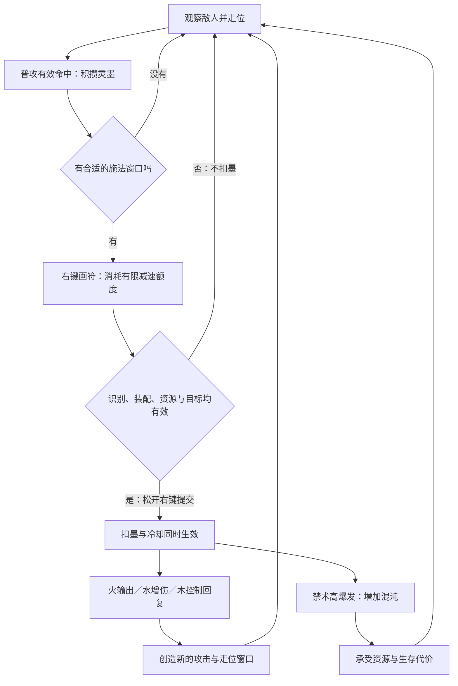
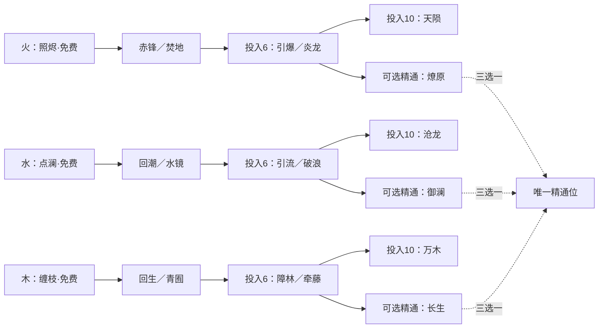

# 灵墨画符：技能构筑与战斗架构 v1

**设计前提：第三人称、单人即时动作战斗；按住右键进入画符，世界短暂减速。** 三系自由学习，选择一种精通，隐藏混系以混沌风险交换极高爆发。本稿的点数、倍率、时长、阈值均是首轮原型参数，尚未经过实际动画、识别测试或战斗平衡验证。

## 1. 总体架构

核心体验是：**读招与走位 → 普攻积墨 → 找到短暂空当 → 画符改变战场 → 抓住元素联动窗口 → 回到动作战斗。**

画符不替代走位，辅助技能帮助玩家制造下一次攻击或画符机会。普通攻击应具备基础硬直、命中反馈与闪避衔接，不能只是没有乐趣的充电动作。

| 层级 | 规则 | 玩家做出的选择 |
| --- | --- | --- |
| 动作层 | 普攻、走位、闪避、锁定，不消耗灵墨 | 什么时候攻击，什么时候让出位置 |
| 资源层 | 灵墨 0–100；专注控制画符减速额度；混沌 0–100 | 现在花墨还是留给保命／爆发 |
| 学习层 | 火、水、木三棵树共享 24 修习点 | 深入一系还是投资跨系工具 |
| 装配层 | 最多 5 个主动符位，其中最多 1 个禁术 | 学会的技能中，哪些带进本场战斗 |
| 精通层 | 一个精通位，三选一 | 强化燃烧、元素连携，或阵地续航 |
| 隐藏层 | 通过发现禁印与专属事件解锁，不因画错触发 | 是否用持续风险换一次高伤窗口 |

## 2. 第三人称操作与画符

### 2.1 输入闭环

1. 普通状态下，鼠标控制镜头，左键攻击，右键按住进入画符；锁定目标可单独绑定按键。原有闪避不占主动符位。
2. 打开时记录锁定目标、准星方向或地面落点；固定镜头朝向，鼠标切换到画板。画板位于画面下部，不遮挡敌人上半身与主要地面预警。
3. 按住右键期间，左键拖拽落笔，松开左键结束一笔；允许多笔。保留 WASD 走位输入，但不能同时普攻。角色与敌人动作共同受世界减速影响，玩家没有无敌。
4. 每笔结束后显示当前候选、费用、冷却与落点。松开右键才确认施放，画完不会立即自动释放。
5. 闪避或 Esc 取消画符；闪避仍遵守动作限制和自身冷却。退出时清除积累的鼠标视角输入，避免镜头突然跳转。

### 2.2 有限减速，而不是可反复打开的暂停

| 参数 | 原型值 |
| --- | --- |
| 画符世界速度 | 正常速度的 35% |
| 专注上限 | 1.8 秒现实时间的减速额度 |
| 消耗 | 面板开启时每现实秒消耗 1 秒额度 |
| 恢复 | 面板关闭，且处于有效战斗时，每世界秒恢复 0.3 秒额度；从空到满需 6 世界秒 |
| 有效战斗 | 近 6 世界秒内，玩家对存活敌人造成有效直接命中，或成功闪避一次敌方攻击；持续伤害不维持此状态 |
| 额度耗尽 | 自动取消尚未提交的画符，恢复时间，不扣墨 |
| 再次进入门槛 | 剩余额度至少 0.6 秒；开关面板不重置额度 |
| 非战斗时 | 可正常练符，安全点恢复专注；进入正式战斗时使用当下额度 |

所有冷却、状态持续、控制递减、混沌结算与恢复都使用**世界战斗时间**；只有鼠标采样、输入超时与专注消耗使用现实时间。1.8 秒画符只推进约 0.63 世界秒，不会通过减速额外赚冷却。

默认参数若使新手来不及画完，应优先改善识别与图形，再测试延长额度。可提供辅助输入模式：延长到 2.6 秒、提高轮廓容错，保持相同伤害规则。辅助模式不作为伤害惩罚项。

### 2.3 瞄准与目标失效

| 技能类型 | 开板时缓存 | 提交时处理 |
| --- | --- | --- |
| 锁定投射物 | 目标实体与备用方向 | 重新检查存活、距离、视线；失效则取消，不偷偷换目标 |
| 地面阵法／陨落 | 合法世界坐标 | 固定该落点；敌人走出范围属于正常躲避 |
| 自身护体／领域 | 施法类型 | 以实际释放时玩家位置为中心 |
| 扇形／射线 | 玩家朝向与准星方向 | 保持预览方向，按技能允许的转向幅度释放 |

不得使用画符鼠标最终位置重新做战场瞄准。镜头碰撞可改变相机距离，但不改变缓存施法方向。高低差、墙后、空中落点需要分别显示合法性。

### 2.4 符形系统

采用固定的“元素印头＋符身”，而非随装配改变手势含义。印头与符身使用相邻分区，允许分笔绘制。

| 部分 | 图形 | 含义 |
| --- | --- | --- |
| 火印头 | △ | 火系 |
| 水印头 | ～ | 水系 |
| 木印头 | Y | 木系 |
| 符身 1 | 一 | 各树第 1 个主动技能 |
| 符身 2 | ○ | 各树第 2 个主动技能 |
| 符身 3 | × | 各树第 3 个主动技能 |
| 符身 4 | 门形 Π | 各树第 4 个主动技能 |
| 符身 5 | 闪电折线 | 各树第 5 个主动技能 |
| 符身 6 | 内收螺旋 | 各树第 6 个主动技能 |

例如“△＋门形”永远是引爆符 F4。槽位改变不改变符形。这里用开放门形替代方框，减少与圆环的混淆。

识别先做整体归一化，再检查端点、闭合、分叉、转角与方向等拓扑特征。支持平移和等比缩放，容忍小幅旋转；是否忽略笔顺由真实手写样本确定。原型候选分数门槛可先设 0.85、第一与第二候选差至少 0.15，但这些分数不是概率，也不能直接跨算法复用。

运行时同时保留全局符形字典与已装备过滤：画对未装备技能时显示“未装配”，不能吸附成另一个已装备技能。低置信度显示“符形未明”，不猜测。允许撤销上一笔；主动符位始终展示小抄。

禁术使用单独的禁印区：**菱形内一点的禁印头＋对应符身**，不会与三元素印头共用分类出口。必须同时满足发现、学习前置、装配和禁印完整；普通符形叠画、识别失败均不能触发禁术。

## 3. 灵墨、伤害与公共状态

### 3.1 灵墨

- 上限 100；原型每次从安全点出发为 30。正常脱战不自动补墨，不允许通过切换配装回满。
- 普攻每次有效攻击命中回 4；一段攻击命中多人或包含多段伤害，合计最多回 6。全局产墨上限 12／世界秒，随后应用混沌惩罚。
- “有效攻击”由一次攻击动作的唯一 AttackId 界定，不按粒子命中次数计算；尸体、无敌目标、训练靶不产出正式战斗资源。
- 技能、灼烧、领域、复制伤害、召唤物与元素反应默认不回墨。只有明确注明的普攻天赋可提高回墨。
- 不引入暴击回墨、击杀回墨和伤害吸墨作为首版通用词条，先稳定动作循环。
- 识别成功不预扣；在释放提交时一次性验证并扣除费用，同时启动冷却。提交失败不扣，提交成功后取消后摇不退款。

### 3.2 统一数值口径

记 A 为角色当前攻击强度。表中的 120% 指 1.2A；治疗与护盾按最大生命值 H 计算。范围为半径，距离单位为米，所有时长为世界秒，除非明确写现实秒。

普通攻击单次伤害先以 100%A 为基准，典型有效攻击频率以 1.5 次／世界秒做纸面估算。技能前摇建议：普通 0.25–0.45 秒，高阶 0.6–0.8 秒；具体值必须适配角色动作。

同类增伤先加算；目标“受到法术伤害提高”合计封顶 35%，减益不相互无限乘算。同名状态刷新或取更高值，不按施法数量倍乘。直接常规伤害可以使用独立暴击系统；持续、反应、复制、治疗与禁术默认不暴击。

### 3.3 三个基础状态

| 状态 | 初始规则 | 边界 |
| --- | --- | --- |
| 烬痕 | 每层 6 秒内共 60%A 火持续伤害，最多 3 层；再次施加在上限时只刷新最早一层 | 独立层各自计时；只有技能明确的附层次数生效；火精通升至 5 层 |
| 润印 | 默认 6 秒，使目标受到法术伤害 +15% | 普攻不享受该增伤；叠加只刷新，不多层乘算；火／木连携可消耗 |
| 根缚 | 普通敌人无法移动，但仍可执行无需移动的攻击 | 属于硬控递减；不能把根缚当成眩晕或无敌窗口 |

领域同名最多存在一个；重新释放替换旧领域，不叠加。不同治疗领域重叠时，只采用最高的持续治疗速率；直接治疗可正常结算。护盾统一记录来源，并受总上限 25%H 约束，不允许无限叠加。

### 3.4 常规跨系联动

| 顺序 | 反应 | 规则 |
| --- | --- | --- |
| 水 → 火 | 蒸燃 | 常规火直接命中带润印目标：该次命中先享受润印，随后消耗润印，产生 60%A、半径 3 米的额外伤害 |
| 木 → 火 | 燃藤 | 常规火直接命中根缚目标：追加 4 秒内共 80%A 持续伤害，不延长根缚 |
| 水 → 木 | 滋生 | 木控制命中润印目标：消耗润印，普通敌人本次根缚基础时长 +0.5 秒；玩家恢复 2%H，每次施法最多恢复 4%H |

蒸燃同一目标每 3 秒最多一次，燃藤每 4 秒最多一次，滋生每次施法对同一目标最多一次；都由根施法 CastId 限制。反应伤害不施加状态、不触发反应、不回墨、不触发命中天赋。

根缚与润印同时存在时，火命中可以触发蒸燃和燃藤，但各自遵守上限。水系本身不熄灭烬痕，木系不会被友方火法术销毁，避免合理混搭互相惩罚。

## 4. 学习、装配与精通

### 4.1 修习点经济

- 首轮完整构筑预算为 **24 点**；三系共用一个点池。原型可按剧情阶段发放 6／12／18／24 点，正式游戏再替换为等级或探索奖励。
- F1、W1、M1 三个基础符免费掌握，不算本系投入，不自动占符位。
- 每系其余五个主动技能费用为 2、2、3、3、4 点；三个被动各 2 级、每级 1 点。
- 每系共 6 个主动、3 个被动和 1 个精通，即三系共 **30 个命名节点**；另有 6 个隐藏主动禁术。被动的第二级不是新技能。
- 基础分支直接开放。进阶主动要求本系已投入至少 6 点且满足对应前置；高阶主动要求已投入至少 10 点并掌握一个指定进阶技能。门槛均不把待购买节点自身费用算进去。
- 第二被动要求本系已投入 4 点；第三被动要求 8 点。第一个被动无门槛。
- 精通费用 4 点，要求该系已投入 10 点且完成“定道”剧情／试炼；同时只能生效一种。精通费用不算本系门槛投入。
- 三系基础、进阶、高阶技能都允许混学，不因精通选择被锁住。24 点使深度、工具和精通之间形成取舍。
- 主动最多装 5 个，禁术最多占 1 个。已学被动全部生效，防循环上限仍然有效。
- 安全点免费洗点、切精通、换符位。洗点统一退款并按依赖关系撤下失效节点和装配，不允许留下前置已消失的高阶技能。战斗中不能换装。

### 4.2 三系结构总览

图为层级概览；具体前置以各技能表为准。高阶技能与精通是并列投资项，精通不要求先学终结技。

## 5. 火系：持续施压与伤害兑现

定位：提供最稳定的常规伤害，通过叠烬痕和引爆在安全窗口兑现爆发。三条倾向为近身火刃、燃烧结算、远程大范围爆发。

| ID／符身 | 技能 | 点数／前置 | 灵墨／冷却 | 初始效果 | 特效对应 |
| --- | --- | --- | --- | --- | --- |
| F1／一 | 照烬符 | 免费 | 20／4秒 | 18米火弹，120%A，附1层烬痕 | Projectile、Hit、Orb |
| F2／○ | 赤锋符 | 2 | 25／6秒 | 前方6米扇形火刃，180%A，附1层烬痕 | Slash |
| F3／× | 焚地符 | 2 | 35／10秒 | 16米内放半径3米火域，持续6秒；每目标初次接触60%A直接伤害并附1层烬痕，后续持续伤害总计最多180%A | Uplaser、Explosion |
| F4／Π | 引爆符 | 3；本系6点且学F3 | 35／10秒 | 16米内半径3米爆裂，180%A；逐目标消耗全部烬痕，每层另加70%A | Explosion、Hit |
| F5／折线 | 炎龙符 | 3；本系6点且学F2 | 45／14秒 | 20米路径炎龙，穿行共320%A；每个目标最多附2层烬痕 | Dragon |
| F6／螺旋 | 天陨符 | 4；本系10点且学F4或F5 | 60／22秒 | 20米内落点延迟0.9秒，半径4米450%A，附3层烬痕 | Meteor、Explosion |

引爆移除烬痕剩余持续伤害，以表内每层70%A替代结算，不能同时补发剩余燃烧，避免重复兑现。领域和多段炎龙的表内伤害是一次施法对单目标的总额，不是每个粒子的伤害。

| 被动 | 费用／门槛 | 1级 → 2级 |
| --- | --- | --- |
| FP1 余烬 | 每级1；无 | 烬痕总伤害 +10% → +20%，不改层数与持续时间 |
| FP2 焦锋 | 每级1；本系4点 | 普攻直接命中带烬痕敌人，伤害 +10% → +20% |
| FP3 蓄炎 | 每级1；本系8点 | 3次有效普攻后，下次常规火符伤害 +8% → +16%；使用后清空，不作用于禁术 |

**火精通·燎原，4点：**烬痕上限由3升至5；引爆可消耗到5层。常规火符的直接命中会将该目标已有烬痕的剩余时间刷新到6秒，每次施法每目标最多刷新一次；领域持续跳伤不刷新。刷新保留每秒伤害速率，不补发已经过去的持续伤害。原有附层次数不增加，必须通过多次施法积累。优势是长线压制与高质量引爆；弱点是转火、丢失层数及施法机会不足。

## 6. 水系：标记、连携与增伤窗口

定位：不是低伤害版火系。水通过润印、传导和稳定普攻供墨，放大后续动作的价值；单独水系也能靠普攻＋射流作战，但纯瞬间伤害弱于火。

| ID／符身 | 技能 | 点数／前置 | 灵墨／冷却 | 初始效果 | 特效对应 |
| --- | --- | --- | --- | --- | --- |
| W1／一 | 点澜符 | 免费 | 20／4秒 | 18米水弹，70%A，施加6秒润印 | Basic Water、Trail |
| W2／○ | 回潮符 | 2 | 25／8秒 | 前方8米水波，100%A，润印6秒并减速20%持续3秒 | Water Shockwave |
| W3／× | 水镜符 | 2 | 30／12秒 | 自身获得12%H护盾，持续6秒；没有反射或无敌 | Helix、Water Spline Trail |
| W4／Π | 引流符 | 3；本系6点且学W2 | 35／12秒 | 16米内连接最多3名敌人6秒，首次附润印；主目标受到常规直接伤害的25%复制给另外目标 | Spline Trail、Helix |
| W5／折线 | 破浪符 | 3；本系6点且学W1 | 40／14秒 | 20米射流，1.2秒内共240%A，润印8秒；目标下次常规法术受伤额外+10%，6秒内有效一次 | Water Laser |
| W6／螺旋 | 沧龙符 | 4；本系10点且学W4或W5 | 55／22秒 | 20米内半径4米水龙冲击，260%A，润印8秒；目标6秒内受削韧提高25% | Water Dragon Explosion |

引流每个被连接的副目标每秒最多收到一次复制，每次施法对每个副目标复制总额最多120%A。复制不暴击、不传递状态、不再复制、不触发反应或回墨；禁术、持续伤害、反应伤害不参与复制。玩家一次范围攻击同时命中多个目标时，也必须按同一个根伤害事件防止互相复制。

破浪的额外受伤只强化下一次常规技能对该目标的直接伤害包，范围或多段技能视为同一次施法，总加成上限为该施法基础直接伤害的10%，不逐段重置；不强化禁术。

| 被动 | 费用／门槛 | 1级 → 2级 |
| --- | --- | --- |
| WP1 长润 | 每级1；无 | 润印持续时间 +1 → +2秒 |
| WP2 湿锋 | 每级1；本系4点 | 普攻命中润印目标额外回墨 +1 → +2；仍受每攻击6点、每秒12点总上限 |
| WP3 涟护 | 每级1；本系8点 | 常规水符提交后获得2% → 4%H护盾，内部冷却8秒，持续6秒；遵守总护盾上限 |

**水精通·御澜，4点：**润印增伤由15%升至20%；常规水符释放后，下次异系常规法术在6秒内费用减少5，最多降低该技能基础费用的20%，每8秒一次。不能减禁术费用，不叠加、不因取消施法消耗；成功提交目标法术时消耗。优势是跨系循环与低墨连携，弱点是爆发更依赖顺序。

## 7. 木系：控制、阵地与恢复

定位：创造喘息与稳定输出位置。控制不等于敌人完全不能攻击，回复需要花墨，首领通过削韧而不是永久束缚处理。

| ID／符身 | 技能 | 点数／前置 | 灵墨／冷却 | 初始效果 | 特效对应 |
| --- | --- | --- | --- | --- | --- |
| M1／一 | 缠枝符 | 免费 | 20／6秒 | 16米藤击，60%A，普通敌人根缚1.2秒 | Vine Attack、Growth |
| M2／○ | 回生符 | 2 | 30／12秒 | 自身2秒内恢复10%H；可被治疗削减影响 | Heal Beam、Rune Particle |
| M3／× | 青囿符 | 2 | 35／14秒 | 自身半径3米领域6秒，敌人每秒30%A并减速20%；玩家在场内每秒恢复1%H | Area Buff、Vine Growth |
| M4／Π | 障林符 | 3；本系6点且学M3 | 35／14秒 | 前方藤障5秒，阻挡普通敌方非穿透投射物；出现时根缚触及敌人1秒 | Vine Barrier |
| M5／折线 | 牵藤符 | 3；本系6点且学M1 | 40／14秒 | 16米内半径4米最多5个目标，160%A，根缚1.8秒 | Vine Attack、Growth |
| M6／螺旋 | 万木符 | 4；本系10点且学M4或M5 | 55／24秒 | 自身半径4米阵8秒，每秒35%A；初次根缚1.8秒；前4秒在阵内每秒恢复2%H | Area Buff、Growth、Heal Beam |

障林只拦指定投射物，不阻挡角色移动，也不阻挡首领贯穿光束、地面攻击和已进入屏障内部的攻击；持续期间不会反复施加根缚。首版采用时限屏障，不引入额外屏障生命值系统。

| 被动 | 费用／门槛 | 1级 → 2级 |
| --- | --- | --- |
| MP1 深根 | 每级1；无 | 普通敌人根缚基础时长 +10% → +20%；对首领相关技能削韧 +5% → +10% |
| MP2 回春 | 每级1；本系4点 | 自身木技能治疗量 +10% → +20%，不强化非技能拾取治疗 |
| MP3 安身 | 每级1；本系8点 | 位于自身木领域中时受伤降低4% → 8%；多个自身领域不重复叠加 |

**木精通·长生，4点：**自身木领域与障林持续时间+2秒；木技能溢出治疗的50%变为6秒护盾，该来源上限10%H，并遵守全局护盾上限。青囿按每秒治疗／伤害继续生效；万木的治疗仍仅前4秒，伤害随场持续时间延长。优势是阵地战与容错，弱点是频繁转场。

## 8. 控制与首领适配

- 同一目标8秒内连续硬控持续系数为100% → 50% → 25%；第三次结束后获得4秒硬控免疫。首次控制开始建立窗口，免疫结束后可重建新窗口。
- 同一施法对同一目标最多施加一次硬控；领域重入不重新根缚。减速不叠加，取最高值，普通敌人上限40%。
- 精英基础硬控时长乘0.5，再应用递减。首领根缚不直接限制移动，而转为削韧。
- 原型首领韧性条100：M1削韧12、M4削韧10、M5削韧20、M6初次削韧25；滋生对首领不增加控制时长，改为该次削韧+20%，仍可触发受限治疗。
- 首领破韧后进入2秒明确硬直，恢复行动后6秒内不接受新的削韧；硬直不能在破韧期间累积到下一次。不同阶段可以重置并重新定义窗口。
- 对强制位移不做首版通用规则，避免VFX表现与碰撞、悬崖秒杀产生大量额外边界问题。

## 9. 隐藏混系：禁术与混沌

### 9.1 学习与身份

混系不是第四棵公开加点树。玩家先通过正常元素联动发现残印，再完成固定探索／试炼获得禁术记录。前置按三系实际修习点检查，不计免费技能和精通点。

禁术不再扣额外修习点，但会占主动符位，并且最多装备一个。通过装备机会成本、跨系投资、灵墨、共享冷却和混沌承担五重代价。解锁事件应有可重复完成路径，不依赖随机掉落或非常隐晦的笔画猜谜。

| ID／禁符身 | 禁术 | 学习前置 | 灵墨／冷却／混沌 | 初始效果与对应特效 |
| --- | --- | --- | --- | --- |
| H1／一 | 蒸天劫 | 火4点＋水4点；发现水火禁印 | 65／24秒／+30 | 半径4米900%A爆发；Cosmic Explosion、Laser配水汽过渡 |
| H2／○ | 烬木葬 | 火4点＋木4点；发现火木禁印 | 70／26秒／+35 | 落点延迟0.8秒，半径4米1050%A；Cosmic Meteor、Explosion配藤根轮廓 |
| H3／× | 溟根蚀 | 水4点＋木4点；发现水木禁印 | 65／24秒／+30 | 固定半径4米侵蚀区，3秒内总900%A；Cosmic Ground Attack、Aura；无额外控制 |
| H4／Π | 三相归墟 | 三系各3点；完成三相试炼 | 80／30秒／+40 | 半径5米1300%A爆发；Cosmic Magic Circle、Explosion |
| H5／折线 | 墨界断空 | 火4点＋水4点＋木3点；发现断空禁印 | 75／26秒／+35 | 22米直线路径1150%A，每目标一次；Cosmic Slash、Slash Trail |
| H6／螺旋 | 太初寂灭 | 三系各4点＋已选精通；完成终局禁术试炼 | 90／36秒／+50 | 落点延迟1秒，半径5米1700%A；Cosmic Meteor、Magic Circle、Explosion |

全部禁术使用同一冷却组，组冷却取本次技能表内时间。各自符形身份固定；即使当前只装备一个，也不能任意禁印都匹配它。

禁术伤害类型独立，不施加烬痕、润印或根缚，不触发常规元素反应、引流复制、回墨天赋、火系蓄炎或水精通减费。可享受目标当时已有的润印易伤，但不消耗它。禁术默认不暴击。

这使禁术单次伤害约为多数高阶常规技能的2–3倍以上，但不能推导为整场DPS同等提高；回墨代价、冷却、覆盖范围、命中率与混沌会改变收益。

### 9.2 混沌分段

| 混沌 | 名称 | 当前惩罚 | 禁术额外伤害 |
| --- | --- | --- | --- |
| 0–24 | 澄明 | 无 | 0 |
| 25–49 | 墨浊 | 灵墨获取 -10% | 0 |
| 50–74 | 失衡 | 回墨 -10%，受到治疗 -20% | +10% |
| 75–99 | 临界 | 回墨 -10%，受到治疗 -20%，受伤 +20% | +20%，替代上一档10% |
| 提交后达到或超过100 | 反噬 | 见下述固定结算 | 使用提交前的混沌档位计算本次伤害 |

混沌加成以**提交前**的混沌为快照；本次技能不能通过自己加的混沌吃到新档增伤。扣墨成功后立即增加混沌，新档常规惩罚立即生效。

当提交后达到100时：当下将混沌回落到60并进入8世界秒反噬状态；1.2世界秒后损失12%H，忽略护盾，但该笔伤害最低把玩家留在1生命；不打断已提交禁术。敌人的伤害仍可能致死。反噬期间禁术不可用，回墨效率降低50%（替代通常的10%惩罚），治疗削减按60点混沌的档位生效。计时和扣血一经安排，不会因关面板、闪避、换镜头或提前击杀目标取消。

UI在提交前显示“本次混沌 +X，预计达到Y／触发反噬”。不增加额外确认弹窗。混沌不扭曲鼠标，不偷偷修改已识别符形，不用随机误放技能作为惩罚。

### 9.3 混沌恢复

- 玩家普攻或常规技能直接命中存活敌人时，每世界秒最多降低0.5点。每次常规施法最多贡献1.5点，持续、反应、复制与禁术伤害不能贡献；内部保留小数精度。
- 反噬状态期间不降混沌；状态结束后按正常规则恢复。
- 脱战后每世界秒降低1点，最低只降到40；原本低于40不会被抬高。安全点才完全清除。
- 治疗、空放木技能、反复开画板不会净化混沌。回复能力只能处理生命损失，无法替代禁术的资源惩罚。
- 禁术的条件伤害与风险档位都在UI中明确说明，避免玩家因不知道代价而受到惩罚。

恢复速度必须低于按冷却连续施放禁术时的混沌积累。以H4为例，即使30秒冷却内每秒都成功获得恢复，也只降15点，低于一次增加的40点；从0开始，四次提交前的混沌依次最低约为0、25、50、75，第四次会反噬。此为不脱战、不去安全点、按冷却连续施放且资源足够时的纸面上限例子，不是实际输出循环保证。

## 10. 四套完整构筑示例

下列点数都正好24；均满足学习与精通门槛。配点列出全部付费节点，未列出的付费节点不学习；基础F1/W1/M1免费保留。循环中的“普攻回墨”是必需步骤，不代表能从30初始墨连续释放全部技能。

### A. 赤潮焚阵：火精通，持续燃烧与引爆

- 火12：F2(2)、F3(2)、F4(3)、FP1二级(2)、FP2二级(2)、FP3一级(1)。水6：W2(2)、WP1二级(2)、WP2二级(2)。木2：M2(2)。燎原精通4。
- 五符：**F1照烬、F3焚地、F4引爆、W1点澜、M2回生**。
- 循环：积墨到55以上 → W1润印 → F3蒸燃与火域 → 普攻回墨并用F1补烬痕 → F4兑现 → 留30墨作回血余量。
- 强处：怪群持续输出、精英战；弱处：频繁转火、层数消失、贪引爆后无墨治疗。
- 禁术变体：获得H1后替换M2，得到高爆发但失去主动回复；不是免费增加第六个技能。

### B. 镜澜引劫：水精通，多目标传导

- 水12：W2(2)、W3(2)、W4(3)、WP1二级(2)、WP2二级(2)、WP3一级(1)。火6：F2(2)、F3(2)、FP1二级(2)。木2：M2(2)。御澜精通4。
- 五符：**W1点澜、W4引流、F3焚地、F2赤锋、M2回生**。
- 循环：W4连接怪群 → 精通减费后接F3铺场 → 普攻主目标回墨 → F2抓近身窗口 → W1维持关键标记。
- 强处：小群精英、多目标；弱处：单体首领会损失传导价值，应在安全点把W4换W3护体或重配W5路线。

### C. 青囚烬生：木精通，阵地续航

- 木12：M2(2)、M3(2)、M5(3)、MP1二级(2)、MP2二级(2)、MP3一级(1)。火6：F2(2)、F3(2)、FP1二级(2)。水2：W2(2)。长生精通4。
- 五符：**M5牵藤、M3青囿、M2回生、F3焚地、W1点澜**。
- 循环：W1 → M5滋生与束缚 → 普攻回墨 → F3燃藤 → M3建立恢复阵地；受压时用M2。
- 强处：持续压力、需要容错的战斗；弱处：快速敌人、场景频繁换区。首领战靠削韧创造窗口，不期待根缚定住首领。

### D. 三相涉险：水精通，三系工具与隐藏收尾

- 水10：W2(2)、W3(2)、W4(3)、WP1二级(2)、WP2一级(1)。火5：F2(2)、F3(2)、FP1一级(1)。木5：M2(2)、M3(2)、MP1一级(1)。御澜精通4。
- 五符：**W1点澜、F3焚地、M3青囿、M2回生、H4三相归墟**。
- 循环：常规三系与普攻建立安全窗口 → 把灵墨存到80 → 对关键目标施加润印后重新回墨 → H4收尾 → 通过常规有效命中降混沌。
- 若在同一个连续窗口想先W1再H4，需要至少100墨；水精通不会减H4费用。30初始墨不能直接开这套爆发。
- 强处：处理危险精英或首领阶段；弱处：少一个常规进攻符位，且必须等待高墨储备。H6虽满足修习点与精通条件，仍须完成其独立终局解锁。

## 11. 特效与美术表现架构

以下映射只依据用户截图中的文字类型，没有查看实际视频或验证特效工程。素材名称表达视觉用途，不意味着已经包含对应伤害、控制、回血或碰撞逻辑。

| 层 | 设计要求 |
| --- | --- |
| 施法起手 | 统一笔迹、印头成形、纸上收墨；常规法术克制，禁术用明显的禁印与墨裂 |
| 飞行／传播 | 根据Projectile、Trail、Spline等视觉类型制作轨迹；实际路径由玩法层决定 |
| 命中 | 先保证命中停顿、音效与敌人反馈，再控制晕染和粒子数量 |
| 地面范围 | 独立预警／可作用边界，视觉边界不得明显小于真实危险范围 |
| 状态 | 烬痕用小型朱砂余烬，润印用蓝灰水环，根缚用墨绿藤结；头顶简洁图标辅助识别 |
| 混沌 | UI墨池浑浊、边框裂纹、低频音色变化；不遮挡准星或敌方预警 |

需要补做或核实：画符笔锋与轨迹；识别成功／失败反馈；三个状态的常驻标记；落点合法／不合法指示；混沌分档反馈；不同体型藤蔓附着；屏障是否适配第三人称遮挡；水龙／炎龙总时长与伤害触发帧。

水、火、自然、宇宙素材需要统一亮度、饱和度、边缘晕染和透明度，不能假设改色就自动变成水墨。火保留朱砂与焦墨，水保留蓝灰，木保留灰绿；禁术以墨黑和低饱和暗紫呈现，避免高亮宇宙色压过整体风格。

同屏表现优先级：敌方危险预警 > 角色受击／锁定 > 本次技能命中 > 状态 > 余韵装饰。对持续领域与重复命中使用表现合并，不能通过少播粒子减少真实伤害事件。

## 12. 玩法实现的职责划分

不需要先实现完整技能编辑器。先把以下职责分开，后续换技能数据与特效不会改整个战斗循环。

| 模块 | 负责 | 不负责 |
| --- | --- | --- |
| Input & Drawing | 输入模式、轨迹、撤销、画板与锁镜头 | 扣墨、伤害 |
| GlyphRecognizer | 返回固定GlyphId、候选分数与拒绝原因 | 直接释放技能 |
| Build & Unlocks | 修习点、前置、精通、符位、禁术发现记录 | 运行时命中 |
| CastController | 验证、目标快照、提交事务、冷却与取消阶段 | 让VFX自行判伤害 |
| ResourceController | 灵墨、专注额度、混沌与反噬时序 | 识别笔画 |
| AbilityRuntime | 投射物、射线、范围、场、屏障与命中去重 | 决定视觉粒子数量 |
| Status & Reaction | 层数、控制递减、易伤、治疗、反应白名单 | 通过颜色判断元素 |
| Presentation | Niagara／动画／音效／HUD，消费玩法事件 | 授权技能、处理伤害数值 |

### 12.1 一次施法的原子提交

状态顺序：Combat → Drawing → Recognized → Validating → Committed → Executing → Recovery → Combat。

提交前：检查技能是否学习／装备、目标、距离、视线、当前动作、冷却、灵墨、禁术限制。失败回到可继续画符或取消，不扣资源。

提交事务中：分配CastId → 缓存伤害与混沌档位 → 扣除最终费用 → 消耗减费标记 → 启动冷却 → 增加混沌／安排反噬 → 建立玩法实体 → 广播表现事件。失败时整个提交回滚，避免“扣墨但没技能”或“免费技能”。

提交后：闪避只能按动作表取消可取消后摇，不退资源；被击中可打断未保护的长引导，但已发射实体继续存在。没有命中依然支付成本。核心爆发技能建议提交时就建立延迟伤害实体，避免特效播放中断导致伤害丢失。

每次命中携带CastId、SourceSkillId、SourceSchool、DamageKind、TargetId和触发资格标记。多粒子、多碰撞、多段动画只改变展示和明确规定的分段，不默认增加命中次数。

### 12.2 最小数据字段

SkillId、School、GlyphId、SkillPointCost、RequiredInvestment、PrerequisiteSkills、InkCost、CooldownGroup、CooldownSeconds、CastTime、TargetingMode、Range、Radius、BaseDamage、TickSchedule、StatusApplications、ReactionEligibility、ChaosGain、VFXBindings、AnimationBindings、InterruptPolicy。

学习数据、数值、符形模板和表现引用分别存储。若使用Unreal，可由DataAsset／DataTable保存技能定义、组件维护运行时状态、Niagara仅做表现；是否使用GAS取决于项目现有技术栈，本稿不假定已接入。

## 13. 原型范围与验收

### 第一阶段：验证画符与动作是否成立

只做F1照烬、F4引爆、W1点澜、M1缠枝、M2回生；测试配置可以临时授予，不代表正式学习前置取消。配一个近战小怪、一个远程小怪、一个有明显破绽的精英。

优先验收：右键进入／退出不跳镜头；不误放技能；画符后仍能看懂敌人攻击；取消不刷专注；灵墨交易只发生一次。

### 第二阶段：验证混搭和资源

加入F2赤锋、F3焚地、W4引流、M3青囿、M5牵藤、三个精通及学习前置。此阶段用简化表现占位补齐A／B／C构筑的学习前置节点，确保三套普通构筑都可合法配置；不急于补齐所有特效。记录每分钟普攻有效命中、回墨、技能提交、空放、治疗、反应来源、受伤时机。

### 第三阶段：验证风险收益

先加入H4三相归墟与完整混沌，再补其他禁术。比较携带禁术与不携带时的实际通关时间、死亡率、可用墨量和常规技能使用率。

### 第四阶段：补齐技能与表现

扩展剩余主动、节点与特效；通过首领、密集怪群和高低差场景检查适配。完整30节点是扩展目标，不应成为第一轮可玩测试的门槛。

| 验收方向 | 初轮目标／测试 |
| --- | --- |
| 识别 | 先采集至少12名测试者、每人每常规符形10条轨迹；按玩家划分校准集与保留测试集，避免同一人的相近笔迹泄漏 |
| 误放 | 将“识别成错误技能”与“拒绝识别”分开计数；初轮以错误施放低于0.5%为调参目标，并单独报告样本量；这不是可靠性承诺 |
| 速度 | 记录各图形现实时间分布；熟悉后的常规符形中位数争取不高于1.4秒，若尾部经常超过1.8秒，应调整输入而非直接惩罚玩家 |
| 动作节奏 | 检查多数战斗是否需要走位与普攻，画符是否长期压缩到没有动作判断；不把某个固定操作占比当成功标准 |
| 数值 | 单体、三目标、密集群怪分别记录总伤害与回墨；输出必须标明是否计入持续伤害、易伤、暴击、禁术与命中率 |
| 滥用 | 反复开关画板、技能多段重叠、引流互传、同领域重放、尸体产墨、护盾叠加、首领无限硬控、净化混沌循环 |
| 反噬 | 99点时施放、达到100、目标提前死亡、玩家先死亡、施法后闪避、存读档恢复等时序不漏结算、不重复扣血 |
| 性能 | 以目标设备与项目帧率预算为准测量；截图无法证明这些特效在本项目中的实际性能 |

最需要先做出的可玩样机不是整棵树，而是“普攻积墨—水印—火符—走位回墨—木符保命”这一分钟战斗。它成立后，精通与禁术才有稳定的设计基础。
